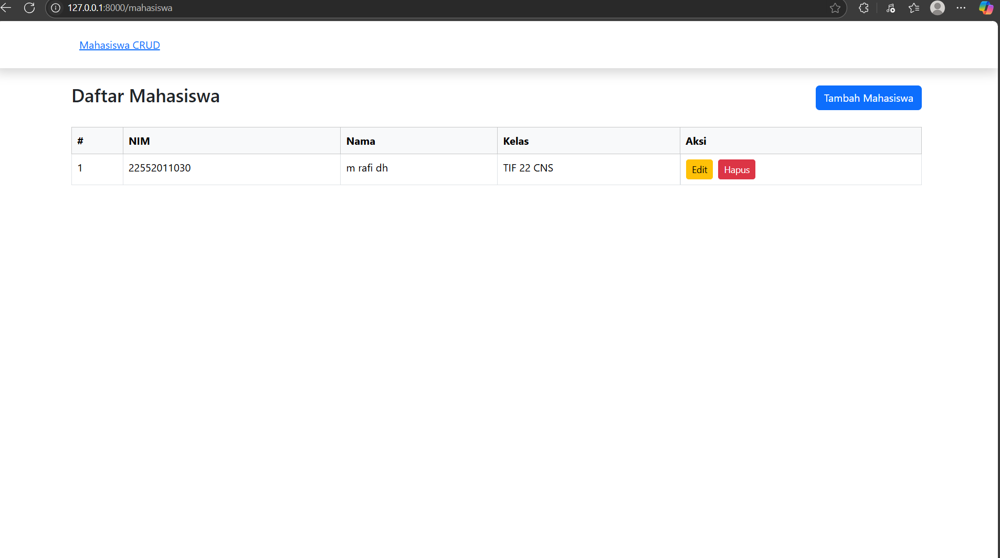
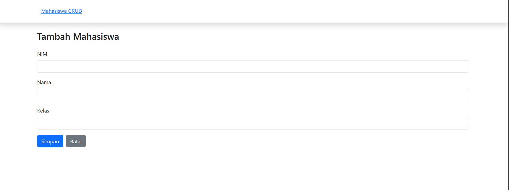
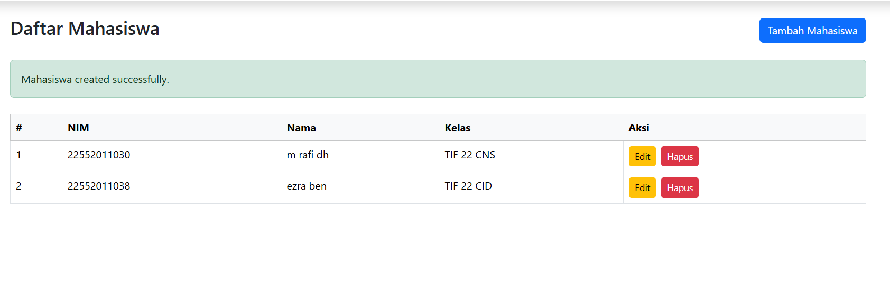
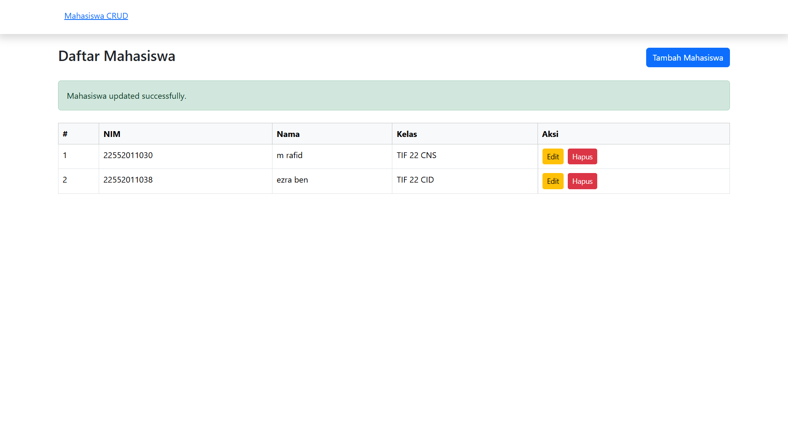
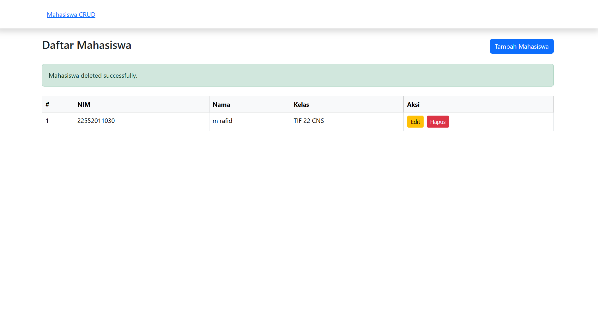

# Laravel CRUD Data Mahasiswa

Proyek ini merupakan implementasi **CRUD (Create, Read, Update, Delete)** sederhana menggunakan **Laravel 12**, **MySQL**, dan **Bootstrap 5**. Aplikasi ini dirancang untuk mengelola data mahasiswa dengan antarmuka yang simpel dan responsif.

## 🛠️ Teknologi yang Digunakan

- **Framework**: Laravel 12
- **Database**: MySQL
- **Frontend**: Bootstrap 5
- **Local Server**: Laragon (Windows)

## 📷 Tampilan Aplikasi

Berikut adalah beberapa tampilan halaman dalam aplikasi ini:

### 1. Dashboard (List Mahasiswa)
Menampilkan seluruh data mahasiswa dalam bentuk tabel, dengan tombol aksi untuk edit dan hapus.


---

### 2. Create Mahasiswa
Halaman form untuk menambahkan data mahasiswa baru.


---

### 3. Hasil Setelah Create
Menampilkan mahasiswa baru yang berhasil ditambahkan.


---

### 4. Edit Mahasiswa
Halaman untuk mengubah data mahasiswa.


---

### 5. Delete Mahasiswa
Menghapus data mahasiswa dari database (disertai tombol konfirmasi).


---

## ⚙️ Fitur CRUD

- **Create**: Tambah data mahasiswa
- **Read**: Tampilkan semua data mahasiswa
- **Update**: Edit data mahasiswa
- **Delete**: Hapus data mahasiswa

## 🧪 Langkah Menjalankan Proyek

1. **Clone repo ini** (jika ada di GitHub):
   ```bash
   git clone https://github.com/nama-kamu/mahasiswa-crud.git
   cd mahasiswa-crud
